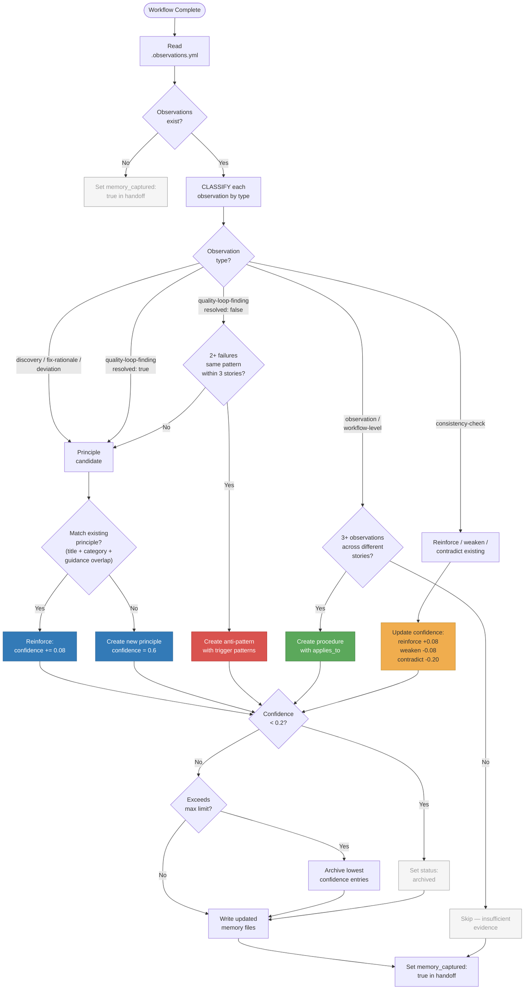

# 32. Memory Capture Decision Tree

Shaktra maintains three long-term memory files: `principles.yml` for project patterns and constraints, `anti-patterns.yml` for failure patterns, and `procedures.yml` for workflow adaptations. During workflows, agents write observations to per-story `.observations.yml` files. After each workflow, the memory-curator consolidates observations into the long-term stores using confidence-based math.

**Reading guide:**
- **Blue nodes** — principle creation and reinforcement. Principles are the primary knowledge store.
- **Red node** — anti-pattern creation. Triggered only by repeated failures (2+ on same pattern).
- **Green node** — procedure creation. Triggered by workflow-level observations across 3+ stories.
- **Yellow node** — confidence updates for existing entries (reinforce/weaken/contradict).
- **Grey nodes** — filtered-out observations or archived entries. Even when nothing is captured, `memory_captured` is set to true.
- All confidence thresholds are read from `settings.memory.*` — never hardcoded.

**Source:** `dist/shaktra/agents/shaktra-memory-curator.md`, `dist/shaktra/skills/shaktra-memory/consolidation-guide.md`
