# 34. Incident Response Workflow

The incident response skill supports 3 intents, each producing different artifacts from the same diagnosis data. All intents follow the same entry pattern (context loading, incident context validation) and exit pattern (memory capture).

```mermaid
flowchart TD
    START["User invokes /shaktra:incident"]
    CLASSIFY{"Classify Intent"}

    subgraph Context ["Context Loading"]
        SETTINGS["Read settings.yml"]
        MEMORY["Read memory files"]
        BRIEFING["Generate briefing\n(tiered retrieval)"]
    end

    subgraph Validate ["Incident Context"]
        DIAG{"Diagnosis artifact\nexists?"}
        LOAD["Load diagnosis +\nstory + handoff"]
        MISSING["INCIDENT_CONTEXT_MISSING\nUser must run /shaktra:bugfix first"]
    end

    subgraph PostMortem ["Post-Mortem Intent"]
        PM_DISPATCH["Dispatch incident-analyst\nintent: post_mortem"]
        PM_TIMELINE["Step 1: Timeline\nreconstruction"]
        PM_CHAIN["Step 2: Root cause\nchain analysis"]
        PM_IMPACT["Step 3: Impact\nassessment"]
        PM_GAPS["Step 4: Detection\ngap summary"]
        PM_ACTIONS["Step 5: Action\nitems"]
        PM_WRITE["Write postmortem.yml"]
        PM_AUTO{"auto_detection_gap\nenabled?"}
        PM_DGAP["Also write\ndetection-gap.yml"]
        PM_RBAUTO{"runbook_auto_generate\nenabled?"}
        PM_RB["Also write\nrunbook.yml"]
    end

    subgraph Runbook ["Runbook Intent"]
        RB_DISPATCH["Dispatch incident-analyst\nintent: runbook"]
        RB_ID["Identification:\nsymptoms, logs, alerts"]
        RB_SEV["Severity assessment:\nP0-P3 criteria"]
        RB_RESP["Immediate response:\nfirst 15 minutes"]
        RB_DIAG["Diagnosis shortcut:\nwhere to look"]
        RB_RES["Resolution:\nfix + rollback"]
        RB_VER["Verification:\ntests + smoke checks"]
        RB_WRITE["Write runbook.yml"]
    end

    subgraph DetGap ["Detection Gap Intent"]
        DG_DISPATCH["Dispatch incident-analyst\nintent: detection_gap"]
        DG_MATRIX["Step 1: Gate coverage\nmatrix"]
        DG_TEST["Step 2: Test gap\nclassification"]
        DG_QUAL["Step 3: Quality dimension\ngap analysis"]
        DG_REC["Step 4:\nRecommendations"]
        DG_WRITE["Write detection-gap.yml"]
    end

    subgraph MemCapture ["Memory Capture"]
        MC_DISPATCH["Dispatch memory-curator\nworkflow_type: incident"]
        MC_CONSOLIDATE["Consolidate observations\n(incident confidence multiplier)"]
        MC_DONE["INCIDENT_MEMORY_CAPTURED"]
    end

    REPORT["Completion Report\n+ Next Step suggestions"]

    START --> Context
    SETTINGS --> MEMORY --> BRIEFING
    Context --> CLASSIFY
    CLASSIFY -->|post-mortem, retro| Validate
    CLASSIFY -->|runbook, playbook| Validate
    CLASSIFY -->|detection gap| Validate

    DIAG -->|No| MISSING
    DIAG -->|Yes| LOAD

    LOAD -->|post_mortem| PM_DISPATCH
    PM_DISPATCH --> PM_TIMELINE --> PM_CHAIN --> PM_IMPACT --> PM_GAPS --> PM_ACTIONS --> PM_WRITE
    PM_WRITE --> PM_AUTO
    PM_AUTO -->|Yes| PM_DGAP --> PM_RBAUTO
    PM_AUTO -->|No| PM_RBAUTO
    PM_RBAUTO -->|Yes| PM_RB --> MemCapture
    PM_RBAUTO -->|No| MemCapture

    LOAD -->|runbook| RB_DISPATCH
    RB_DISPATCH --> RB_ID --> RB_SEV --> RB_RESP --> RB_DIAG --> RB_RES --> RB_VER --> RB_WRITE --> MemCapture

    LOAD -->|detection_gap| DG_DISPATCH
    DG_DISPATCH --> DG_MATRIX --> DG_TEST --> DG_QUAL --> DG_REC --> DG_WRITE --> MemCapture

    MC_DISPATCH --> MC_CONSOLIDATE --> MC_DONE
    MC_DONE --> REPORT
```

### Reading Guide

- **Top:** Context loading and incident context validation are shared across all 3 intents. If no diagnosis artifact exists, the workflow stops with `INCIDENT_CONTEXT_MISSING`.
- **Middle three lanes:** Each intent follows its own process, dispatching the incident-analyst agent with the appropriate intent parameter. The post-mortem intent can auto-generate detection gap and runbook artifacts based on settings.
- **Bottom:** Memory capture is mandatory for all intents, using the incident confidence multiplier from settings.

**Source:** `dist/shaktra/skills/shaktra-incident/SKILL.md`
