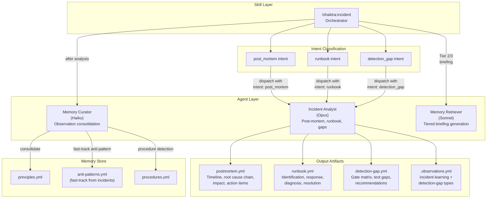

# 35. Incident Agent Dispatch

Shows the dispatch relationship between the `/shaktra:incident` skill and its agents. The skill classifies intent and dispatches the incident-analyst agent with the appropriate parameters. Memory-curator and memory-retriever are shared agents used for knowledge capture and briefing generation.

### Reading Guide

- **Skill layer:** `/shaktra:incident` is the orchestrator that classifies intent and manages dispatch.
- **Intent classification:** Three intents map to the same agent with different parameters. The post-mortem intent may auto-generate runbook and detection gap artifacts based on settings.
- **Agent layer:** Incident Analyst (Opus) handles all analysis work. Memory Curator (Haiku) consolidates observations. Memory Retriever (Sonnet) generates briefings for Tier 2/3 memory stores.
- **Artifacts:** Each intent produces its primary artifact plus observations. All artifacts are written to `.shaktra/incidents/{bug_id}/`.
- **Memory store:** Incident observations receive a confidence multiplier and can fast-track anti-pattern creation.

**Source:** `dist/shaktra/skills/shaktra-incident/SKILL.md`, `dist/shaktra/agents/shaktra-incident-analyst.md`
